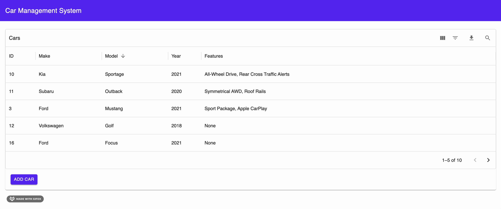

# Car Management System

This is a simple web application that allows a user to manage cars. Cars have a make, model, year, and features.

## How to Run
1. Run the docker compose file in the root directory of the project to spin up the DB locally: `docker-compose up -d`
2. Navigate to the `ui-cars-app` directory.
3. Run `npm i` to install the NPM dependencies.
4. Run `npm run dev` to start the application.
5. Hit `http://localhost:3000/api/seed-data` to seed the local Postgres DB.
6. Go to `http://localhost:3000`

## Technical Details

This is a **Next.js** application that uses client-side React components to hit API endpoints. The database used is **PostgreSQL**. For UI components, I utilized the [Material UI library (MUI)](https://mui.com/) for React.

Here's a diagram showing the database schema, the REST API endpoints, and the pages of the application along with the interactions.

## Features

### View Cars

The home page provides a table that shows all the currently added cars. The table was created using MUI's [DataGrid](https://mui.com/x/react-data-grid/) component. The cars can be sorted by id, make, model, and year. There is also filtering that can be done for all fields. This is currently all done client-side which works for this elementary application, but wouldn't be ideal in a production environment (see [Areas of Improvement](#areas-of-improvement)).

View and Sort Cars

Filter Cars

Clicking on a row will take you to the car details page. Clicking `Add Car` will take you to the add car form (see next section).

### Add Car

Clicking `Add Car` on the home page will take you to the add car form. Here you can enter in the make, model, year, and features (comma-separated, optional).

### Update Car

A car can be updated by clicking `Update` from the car details page. Here a user can modify any aspect of their car or even delete it.

### Delete Car

A car can be deleted from the add car form or the update car form by clicking the `Delete` button.

## Areas of Improvement

- Move sorting, filtering, and searching to the backend. Currently doing these actions on the frontend works, but this can quickly become inefficient with large sets of data. We'd may even want to use a search optimized database such as Elasticsearch. The decision to keep these actions on the frontend was made due to time constraints.
- Add a confirmation dialog prior to the user deleting a car.
- Enable updating and deleting from the table.
- Clean up duplicated code and ensure the code follow best practices for React/Next.js.
- Instead of having make, model, year, and features as free-form inputs,  pull these values from an existing vehicle API. Alternatively, we could create our own DB tables and API for this purpose though that would be burdensome. Either way, this will help keep the integrity of our data and ensure we don't have made up cars (i.e. 1980 Telsa Tacoma).
- The list goes on...

Thank you for checking this project out! Please let me know if you have any questions.

